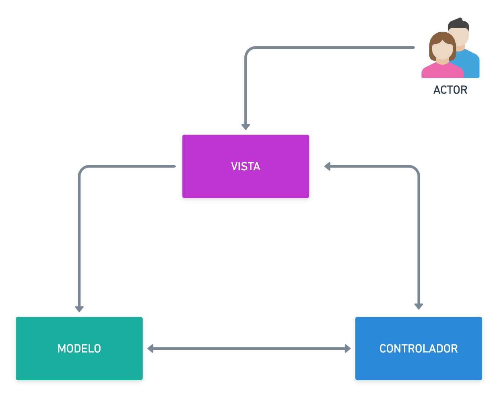

# MVC

# Introduccion

Modelo Vista Controlador (MVC) es un estilo de arquitectura de software que separa los datos de una aplicación, la interfaz de usuario, y la lógica de control en tres componentes distintos. Se trata de un modelo muy maduro y que ha demostrado su validez a lo largo de los años en todo tipo de aplicaciones, y sobre multitud de lenguajes y plataformas de desarrollo.

-`El Modelo` que contiene una representación de los datos que maneja el sistema, su lógica de negocio, y sus mecanismos de persistencia.

-`La Vista`o interfaz de usuario, que compone la información que se envía al cliente y los mecanismos interacción con éste.

-`El Controlador`que actúa como intermediario entre el Modelo y la Vista, gestionando el flujo de información entre ellos y las transformaciones para adaptar los datos a las necesidades de cada uno.

 

# Marco Teórico

##### ¿Que frameworks utiliza el modelo MVC?

Antes de abarcar el tema de que frameworks utliza un modelo MVC debemos entender que es un framework. [NeoAttack](https://neoattack.com/neowiki/framework/) dice que un framework se `puede traducir aproximadamente como marco de trabajo, es el esquema o estructura que se establece y que se aprovecha para desarrollar y organizar un software determinado. Esta definición, algo compleja, podría resumirse como el entorno pensado para hacer más sencilla la programación de cualquier aplicación o herramienta actual.

Ahora algunos [frameworks que utlizan el modelo MVC](https://codigofacilito.com/articulos/mvc-model-view-controller-explicado) son:
* AngularJs
* Django
* Ruby on Rails
* Laravel
* EmberJS
* Backbone
* SailJS

##### ¿Qué ventajas ofrece el modelo MVC?

Algunas [ventajas que nos da el modelo MCV](https://marketiweb.com/empresa/blog/item/114-que-es-la-arquitectura-mvc-y-cuales-son-sus-ventajas#:~:text=Entre%20las%20principales%20ventajas%20que,representaciones%20de%20los%20mismos%20datos.) son:

* Separación clara de dónde tiene que ir cada tipo de lógica, facilitando el mantenimiento y la escalabilidad de nuestra aplicación.
* Sencillez para crear distintas representaciones de los mismos datos.
* Facilidad para la realización de pruebas unitarias de los componentes, así como de aplicar desarrollo guiado por pruebas (Test Driven Development o TDD).
* Reutilización de los componentes
* Motor de Routing asociando una URL concreta con su correspondiente controlador, permitiendo URL semánticas. Las URL semánticas se indexan mejor en los buscadores, siendo más adecuadas para el posicionamiento web.
* Recomendable para el diseño de aplicaciones web compatibles con grandes equipos de desarrolladores y diseñadores web que necesitan gran control sobre el comportamiento de la aplicación

##### ¿Que otros modelos/frameworks existen de patrones de diseño?

Primero que [son los patrones de diseño:](https://profile.es/blog/patrones-de-diseno-de-software/) Se trata de plantillas que identifican problemas en el sistema y proporciona soluciones apropiadas a problemas generales a los que se han enfrentado los desarrolladores durante un largo periodo de tiempo, a través de prueba y error.

Existen muchos patrones de diseño ya que estos hacen que ahorre tiempo en la parte de la codificacion, por ejemplo al trabajar anteriormente con PHP, este tiene ya varias plantillas elaboradas, podemos encontrar desde cosas basicas hasta complejas
Pero esto no quiere decir que el trabajo este hecho, solo es una idea de algo que queremos pero esta en el programador adecuarlo en nuestro trabajo final

# Resultados

### Ejemplos de algunos modelos MVC

### [En PHP]()
    Controllers
      *controlador.php
    Models
      *modelo.php
    Views
      *vista.php
    index.php

### [En java]()

### [En Django]()

